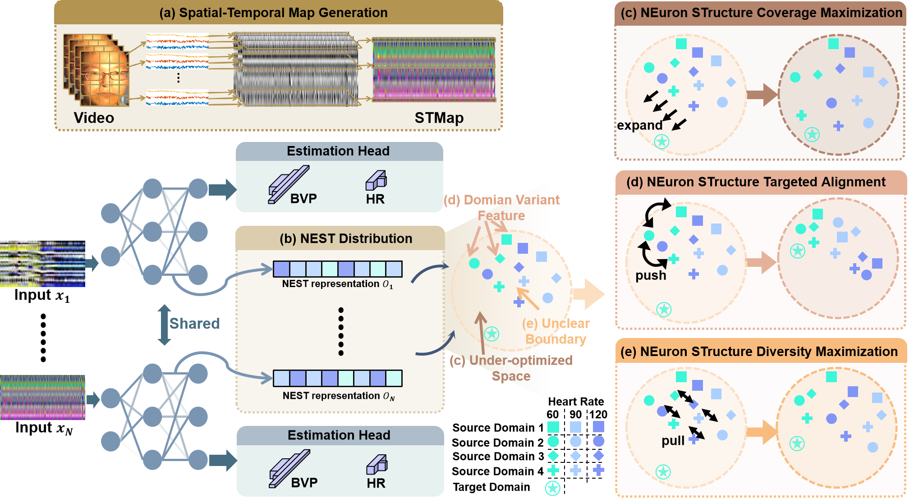

<h1 align="center"> Neuron Structure Modeling for Generalizable Remote Physiological Measurement </h1>

This is official repo for  [**NEST-rPPG**](https://arxiv.org/abs/2303.05955):

<div style="text-align:center;">
  
</div>

A large-scale domain generalization beachmark for rPPG task.

Very easy to run and enjoy it.

## Get dataset
Let's download these data sets:
[**VIPL**](http://vipl.ict.ac.cn/en/resources/databases/201901/t20190104_34800.html),
[**V4V**](https://competitions.codalab.org/competitions/31978),
[**BUAA**](https://ieeexplore.ieee.org/document/9320298),
[**UBFC**](https://sites.google.com/view/ybenezeth/ubfcrppg), 
[**PURE**](https://www.tu-ilmenau.de/en/university/departments/department-of-computer-science-and-automation/profile/institutes-and-groups/institute-of-computer-and-systems-engineering/group-for-neuroinformatics-and-cognitive-robotics/data-sets-code/pulse-rate-detection-dataset-pure).

## Data Pre-processing
We put all the preprocessing in the STMap folder. Examples of VIPL and BUAA are given. See VIPL for data sets with unstable frame rates and BUAA data sets for data sets with stable sampling rates. For details, refer to the Readme.txt file in the folder.

## Train
We provide toy datasets (./NEST-rPPG/STMap.zip) that can be run directly with a single command:

```
cd ./NEST-rPPG
python train.py -g $gpu_ids$ -t 'VIPL'
```

If you want get all well-processed STMap and groud truth label from five datesets, feel free to email me.
## Eval
We use the heart rate estimator of network to evalate the VIPL and V4V datasets. 
We use the BVP signal estimator of network to evalate the BUAA, PURE, and UBFC-rPPG.

For VIPL and V4V:
```
python Eval.py
```

For BUAA, PURE, and UBFC:
```
python dataSort.py  #  save the same video clip to one mat file
cd ./Eval_BVP
run main.m    #  use matlab to caculate the HR, HRV(LF,HF), and RF for evaluation
```

## Keyworks
rPPG; remote heart rate measurement; domain generalization; domain-label-free approach; NEuron STructure modeling (NEST);agnostic domain generalization.


## Citation
```
@InProceedings{lu2023NEST,
  title={Neuron Structure Modeling for Generalizable Remote Physiological Measurement},
  author={Lu, Hao and Yu, Zitong and Niu, Xuesong and Chen, Yingcong},
  booktitle = {Proceedings of the IEEE/CVF Conference on Computer Vision and Pattern Recognition (CVPR)},
  year={2023}
}
```

## Contact information
E-mail: hlu585@connect.hkust-gz.edu.cn

Copyright © 2023, [Hao LU](https://scholar.google.com/citations?user=OrbGCGkAAAAJ&hl=zh-CN), [Ying-Cong Chen](https://www.yingcong.me/), [DV Lab](https://www.dvlab.ai/).


